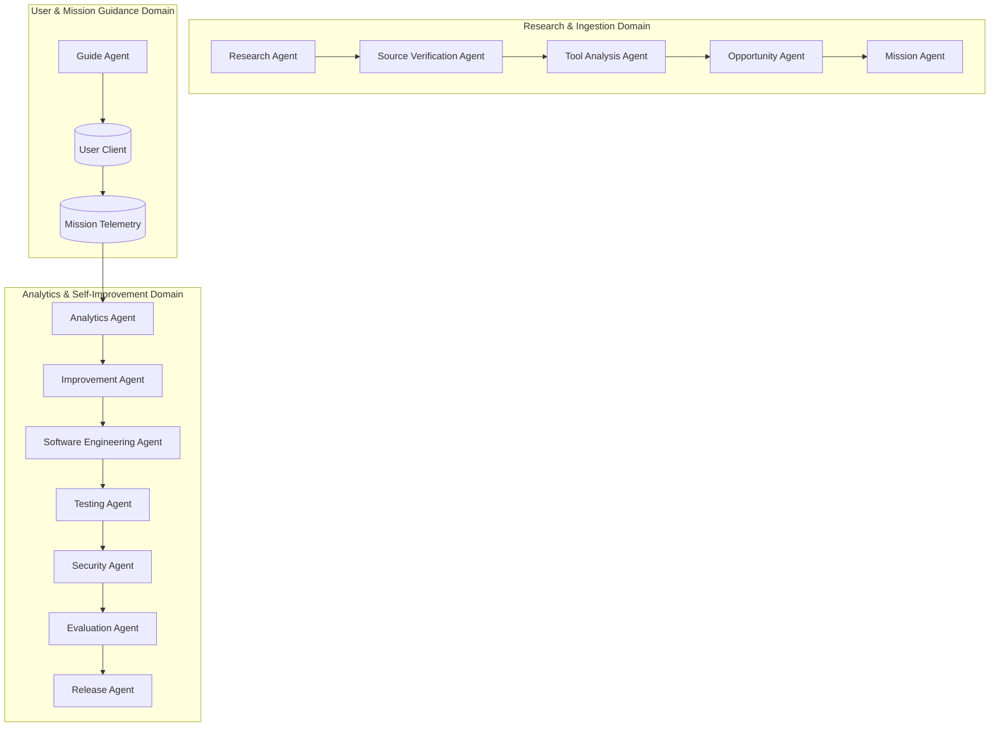

# EarnQuest — Multi-Agent Architecture & Governance

> **Tagline:** *"Turn your computer into an opportunity engine."*  
> **Status:** Specification v1.0  
> **Core Principle:** Specialized Agents, Least Privilege, Zero Unrestricted Autonomy.

---

## 1. Multi-Agent Design Philosophy

No single AI agent in EarnQuest operates with global authority. Instead, the platform divides cognitive responsibilities among discrete, highly specialized agents. Every agent runs with strictly delineated tools, bounded context, rate limits, and approval checkpoints.



---

## 2. Agent Roster & Responsibility Matrix

| Agent | Purpose | Allowed Tools | Input Boundary | Output Artifact |
|---|---|---|---|---|
| **Research Agent** | Scans search providers for emerging free AI tools and income avenues. | `web_search`, `fetch_page` | Web queries, domain filters | Raw research records, links |
| **Source Verification Agent** | Inspects page authority, official status, pricing tables, and SSL. | `check_domain`, `fetch_headers` | Candidate tool URLs | Verified source records |
| **Tool Analysis Agent** | Analyzes free tier limits, local vs browser, license constraints. | `extract_pricing_table`, `parse_tos` | Clean tool text | Normalized Tool schema |
| **Opportunity Agent** | Synthesizes customer problems and matches tools to monetizable services. | `market_demand_lookup`, `calc_scores` | Tool spec, market categories | Opportunity candidate |
| **Mission Agent** | Converts validated opportunities into 10-15 atomic, beginner-friendly steps. | `validate_step_schema` | Opportunity spec | Versioned Mission (`v1.0`) |
| **Guide Agent** | Real-time assistant embedded in the user's mission workspace. | `get_step_context`, `suggest_prompt` | User message, current step | Plaintext explanation, prompts |
| **Analytics Agent** | Ingests mission telemetry, drop-off rates, and user sentiment. | `query_telemetry` | Anonymous session metrics | Friction analysis report |
| **Improvement Agent** | Drafts mission revisions (`v1.1`) to resolve step bottlenecks. | `draft_mission_diff` | Friction report, mission spec | Candidate revision draft |
| **Software Engineering Agent** | Implements low-risk code improvements in isolated sandboxes. | `git_branch`, `edit_sandbox_file` | Approved proposal | Git feature branch |
| **Testing Agent** | Executes automated test suites, linting, and type checking on branches. | `run_vitest`, `run_tsc`, `run_lint` | Candidate branch | Test execution log |
| **Security Agent** | Scans candidate branches for vulnerabilities, secret leaks, and SAIF risks. | `audit_dependencies`, `regex_leak_scan`| Candidate code diff | Security audit report |
| **Evaluation Agent** | Compares candidate changes against historical performance benchmarks. | `benchmark_metric_compare` | Test results, telemetry | Promotion recommendation |
| **Release Agent** | Manages gated deployments and triggers rollback if health checks fail. | `staged_rollout`, `trigger_rollback`| Evaluated release | Deployed revision / Rollback |

---

## 3. Autonomy Levels & Permission Hierarchy

EarnQuest implements a strict 5-tier autonomy framework:

```text
Level 1: OBSERVE
- Agent monitors web data, logs, and telemetry.
- No system modifications permitted.

Level 2: PROPOSE
- Agent generates recommendations, drafts new missions, or suggests code changes.
- Requires explicit Human Administrator approval to proceed.

Level 3: SANDBOX BUILD
- Agent creates isolated feature branches or sandbox missions.
- Runs automated tests, security scans, and type checks.
- Cannot touch production code or live database records.

Level 4: LOW-RISK AUTOMATION
- Agent may automatically deploy pre-approved low-risk updates:
  * Fixing typos or clarifying prompt explanations in mission steps.
  * Updating tool directory tags (e.g., marking a tool as "Freemium with limits").
- Subject to instant automatic rollback if telemetry degrades.

Level 5: PRODUCTION CONTROLLED
- Highly impactful system changes (schema migrations, routing, core UI).
- Requires multi-signature human approval and automated canary rollout.
```

---

## 4. Non-Negotiable Agent Guardrails (The Red Lines)

Under NO circumstances shall any AI agent or autonomous loop have permissions to:
1. **Financial Tampering:** Directly transfer funds, alter ledger journal entries, or change the 80/20 platform fee calculation.
2. **Security Degradation:** Disable CSRF tokens, modify password hashing algorithms, bypass authentication guards, or weaken RBAC middleware.
3. **Secret Access:** Read or expose production API keys, database connection strings, or encryption salts.
4. **Data Destruction:** Run destructive operations (`DROP TABLE`, `DELETE CASCADE`, `TRUNCATE`) on production data stores.
5. **Autonomy Self-Modification:** Modify its own permissions, expand its tool allowlist, or bypass approval gates.
6. **Untrusted Web Execution:** Execute arbitrary code found on external websites without sandboxing and human verification.
7. **Fabrication:** Invent user testimonials, fake revenue metrics, or falsely claim that an integration executed an external action.

---

## 5. Defense Against Prompt Injection & Malicious Content

Because the Research Agent interacts with untrusted external web pages:
- **Indirect Prompt Injection Shield:** External text is sanitized, parsed strictly as data (untrusted input), and wrapped in delimited data blocks.
- **Model Separation:** Search ingestion models are distinct from the executive decision models that generate mission workflows.
- **Output Validation:** All agent outputs must conform strictly to Zod schemas. Any deviation or unexpected payload triggers an immediate failure and quarantines the result.
