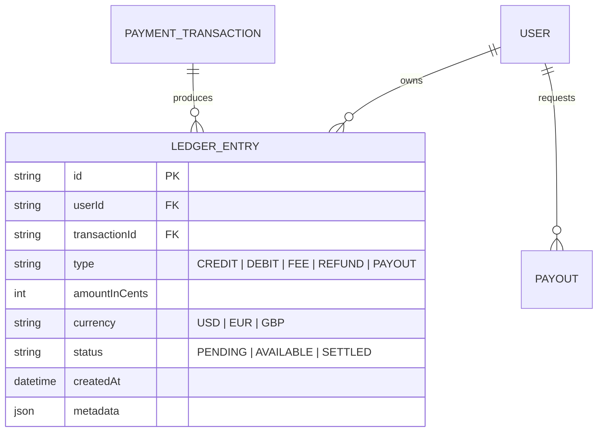

# EarnQuest — Financial Ledger & Payment Architecture

> **Tagline:** *"Turn your computer into an opportunity engine."*  
> **Status:** Specification v1.0  
> **Mandate:** Deterministic integer math, immutable ledger accounting, transparent 80/20 revenue share.

---

## 1. Core Economic Model & Revenue Split

EarnQuest operates on two distinct revenue paradigms:

```text
1. DIRECT PLATFORM COMMERCE (EarnQuest Checkout)
   Customer pays via EarnQuest platform checkout:
   Customer Payment (100%)
   ├── User Earnings (80%)      -> Credited to user ledger balance
   └── Platform Fee (20%)       -> Retained by EarnQuest for operations & AI compute

2. EXTERNAL PLATFORM EARNINGS (Upwork, Gumroad, Fiverr, Direct Client)
   User executes a mission and gets paid directly on an external platform:
   - EarnQuest takes 0% fee.
   - User submits earnings evidence (invoice, receipt, payout screenshot, client confirmation).
   - Tracked in user profile as "External Verified Earnings" after admin/verifier review.
```

---

## 2. Deterministic Integer Currency Math

> **CRITICAL RULE:** Floating-point numbers (`0.1 + 0.2 === 0.30000000000000004`) are strictly prohibited in all financial calculations.

All amounts are represented as 64-bit integer minor currency units:
- **USD/EUR/GBP:** Cents (e.g., `$25.00` is represented as `2500`).
- **JPY:** Yen (e.g., `¥1000` is represented as `1000`).

### Platform Fee Calculation Specification
```typescript
/**
 * Calculates platform fee (20%) and user share (80%) using integer division.
 * Remainder cents are allocated deterministically to avoid fractional losses.
 */
export function calculateRevenueSplit(grossAmountInCents: number): {
  grossAmount: number;
  platformFee: number;
  userShare: number;
} {
  if (grossAmountInCents < 0) {
    throw new Error("Financial amounts cannot be negative");
  }
  // Integer minor unit calculation (20% fee = 2000 bps)
  const platformFee = Math.floor((grossAmountInCents * 20) / 100);
  const userShare = grossAmountInCents - platformFee;

  return {
    grossAmount: grossAmountInCents,
    platformFee,
    userShare,
  };
}
```

---

## 3. Double-Entry Style Immutable Ledger

Every financial event writes an immutable `LedgerEntry`. Entries are append-only. Balances are derived from the sum of journal entries or materialized ledger views. Financial records are **NEVER** updated or deleted in place.



### Ledger Entry Types
1. `CREDIT_SALE_GROSS`: Inflow from customer checkout.
2. `DEBIT_PLATFORM_FEE`: 20% platform charge deduction.
3. `CREDIT_USER_EARNING`: 80% net allocation to user pending balance.
4. `DEBIT_PAYOUT`: Withdrawal to user bank/PayPal account.
5. `REFUND_CHARGE`: Reversal of sale and fee upon disputed transaction.

---

## 4. Payment Provider Abstraction Layer

The application interacts with external financial rails strictly through the `PaymentProvider` interface:

```typescript
export interface CreateCheckoutParams {
  userId: string;
  projectId?: string;
  missionId?: string;
  itemTitle: string;
  amountInCents: number;
  currency: string;
  successUrl: string;
  cancelUrl: string;
}

export interface CheckoutSessionResult {
  sessionId: string;
  checkoutUrl: string;
  expiresAt: Date;
}

export interface PaymentProvider {
  createCheckout(params: CreateCheckoutParams): Promise<CheckoutSessionResult>;
  capturePayment(paymentIntentId: string): Promise<{ success: boolean; transactionId: string }>;
  verifyWebhook(payload: string, signature: string): Promise<{ eventType: string; data: any }>;
  processPayout(userId: string, amountInCents: number, destinationAccount: string): Promise<{ payoutId: string; status: string }>;
  refund(transactionId: string, amountInCents?: number): Promise<{ refundId: string; status: string }>;
}
```

Adapters implemented:
- `MockPaymentProvider`: Simulates checkouts, webhooks, and ledger events for local testing and automated verification.
- `StripePaymentProvider`: Production connector supporting Stripe Checkout, Connect, and Webhook signatures.

---

## 5. External Earnings Verification Workflow

To safeguard platform integrity and reward users legitimately, external earnings undergo a multi-state verification pipeline:

```text
[UNVERIFIED]
   │  (User inputs external payment claim: platform, amount, date)
   ▼
[SUBMITTED]
   │  (User uploads proof: screenshot, PDF invoice, public transaction link)
   ▼
[UNDER_REVIEW]
   │  (Automated checks: image hash deduplication, domain validation)
   ▼
┌──────────────────────┴──────────────────────┐
▼                                             ▼
[VERIFIED]                                [REJECTED]
- Added to user's Public Verified Revenue   - Reason logged (e.g., fake receipt,
- Awards XP & milestone achievements           duplicate submission)
                                            - User notified with dispute option
```

### Anti-Fraud Safeguards
1. **Screenshot Image Hashing:** Computes perceptual hash (pHash) on proof images to detect duplicate submissions across accounts.
2. **Anomaly Thresholds:** First-time users claiming >$1,000 in external earnings trigger mandatory senior admin manual review.
3. **Audit Trail:** Every status transition records the reviewing agent or admin ID, timestamp, and notes.
