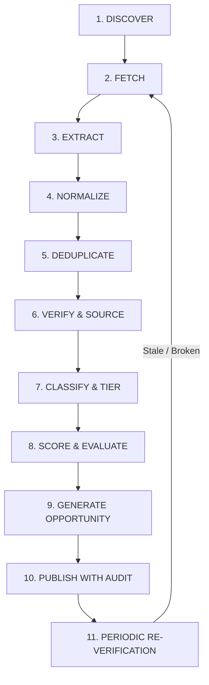

# EarnQuest — Autonomous Research Engine Specification

> **Tagline:** *"Turn your computer into an opportunity engine."*  
> **Status:** Specification v1.0  
> **Mission:** Continuously discover, verify, score, and synthesize legitimate AI tools and market opportunities without human hallucinations or fake data.

---

## 1. Engine Overview & Lifecycle

The Autonomous Research Engine is an intelligent, multi-stage ingestion and evaluation system. It transforms raw, chaotic public web information into structured, verified, actionable opportunities for everyday users.

---

## 2. Detailed Pipeline Stages

### Stage 1: Discovery
- **Trigger:** Scheduled cron jobs (Daily tool scans, Weekly opportunity re-evaluation) or manual Admin search requests.
- **Provider Abstraction:** Connects to search engines (Brave Search API, Exa, Tavily, or local Mock adapter in dev/test).
- **Search Vectors:** Target queries across categories:
  - `"best free AI tools for [video/audio/coding/web design] [year]"`
  - `"open source alternatives to [popular SaaS]"`
  - `"free API tier for [automation/translation/image generation]"`
  - `"in-demand freelance services using AI tools"`

### Stage 2: Fetch & Extraction
- Scrapes target pages using a headless HTTP client with strict timeouts (10s), response size caps (2MB), and user-agent rotation.
- Strips navigation boilerplate, scripts, ads, and cookies to isolate core article/documentation content.

### Stage 3: Normalize & Deduplicate
- Canonicalizes tool names and URLs (e.g., `https://ollama.com/` vs `http://www.ollama.ai`).
- Generates a unique canonical slug (e.g., `ollama-local-llm`).
- Checks existing database records: if already cataloged, updates last-seen timestamps instead of inserting duplicates.

### Stage 4: Verification & Source Hierarchy
EarnQuest prioritizes ground-truth evidence over blog hearsay:
1. **Tier 1 (Highest):** Official tool documentation, official pricing tables, official GitHub repositories.
2. **Tier 2 (High):** Verified package registries (npm, PyPI, Hugging Face).
3. **Tier 3 (Medium):** Well-known developer portals, reputable tech publications.
4. **Tier 4 (Low/Quarantined):** Anonymous affiliate blogs, SEO content farms (requires manual confirmation).

Every record stores:
- `sourceUrl`: Exact URL where data was discovered.
- `retrievedAt`: Timestamp of fetch.
- `lastVerifiedAt`: Date pricing/free tier was last verified.
- `confidence`: Calculated confidence score (0.00 – 1.00).
- `evidenceSnippet`: Verbatim quote proving free availability or commercial usage permissions.

### Stage 5: Free Tool Classification
Tools are rigorously categorized into exact pricing realities:
- `FREE`: 100% free with no payment required (e.g., Audacity, Blender, GIMP).
- `FREEMIUM`: Perpetual free tier with optional paid upgrades.
- `OPEN_SOURCE`: MIT, Apache 2.0, GPL, or compatible license allowing local execution.
- `FREE_SELF_HOSTED`: Free software if run on user's own hardware (e.g., Ollama, ComfyUI).
- `FREE_WITH_LIMITS`: Free tier bounded by daily/monthly tokens, exports, or watermarks.
- `FREE_TRIAL`: Time-limited trial (clearly marked and deprioritized for beginner missions).

---

## 3. The Opportunity Scoring Algorithm

Opportunities are evaluated on an objective 0–100 scale using three distinct composite metrics:

### 3.1. Opportunity Score ($OS \in [0, 100]$)
$$OS = 0.25 \times B + 0.25 \times D + 0.20 \times F + 0.15 \times M + 0.15 \times S$$
Where:
- $B$ = **Beginner Friendliness:** Simplicity of setup, lack of coding requirement.
- $D$ = **Market Demand:** Search volume, freelance marketplace job listings, customer willingness to pay.
- $F$ = **Free Tool Availability:** High availability of zero-cost software to complete the work.
- $M$ = **Monetization Clarity:** Defined path to revenue (service fee, product sale, micro-SaaS).
- $S$ = **Scalability:** Ability to repeat or automate the workflow once mastered.

### 3.2. Risk Score ($RS \in [0, 100]$)
Measures platform risk, legal ambiguity, market saturation, and tool dependency:
$$RS = 0.35 \times \text{PlatformRisk} + 0.35 \times \text{LegalRisk} + 0.30 \times \text{SaturationRisk}$$

### 3.3. Confidence Score ($CS \in [0, 100]$)
Reflects source freshness and verification strength:
$$CS = 0.50 \times \text{SourceReliabilityTier} + 0.30 \times \text{FreshnessFactor} + 0.20 \times \text{EvidenceCompleteness}$$

> **Disclaimer Requirement:** The UI must display: *"Scores reflect automated algorithmic evaluation of current tool availability and market indicators. They are not financial guarantees."*

---

## 4. Cost Control & Failure Resilience

### 4.1. Token & API Budgets
- Ingestion queries use lightweight/cheap extraction models (e.g., `gemini-1.5-flash` or `gpt-4o-mini`) rather than expensive frontier reasoning models.
- Heavy synthesis is only invoked when generating full 15-step mission workflows.
- Cached search results (Redis/Postgres) prevent repeated lookups of identical queries within 7 days.

### 4.2. Circuit Breakers & Retries
- If a web research provider returns `429 Too Many Requests` or `5xx Server Error`:
  - Exponential backoff with jitter (1s, 2s, 4s, 8s).
  - Automatically switches to secondary provider (e.g., Brave -> Tavily -> Mock).
  - Logs structured telemetry to the admin dashboard.
