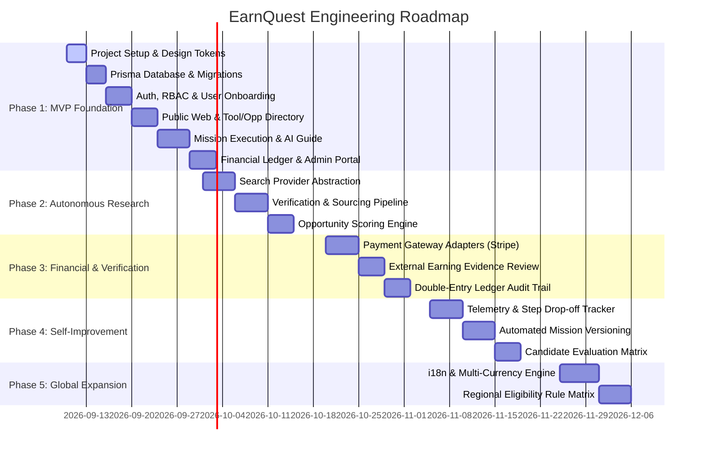

# EarnQuest — Product & Engineering Roadmap

> **Tagline:** *"Turn your computer into an opportunity engine."*  
> **Status:** Baseline Roadmap v1.0  
> **Phased Execution Strategy:** 5 Progressive Milestones

---

## 1. Roadmap Overview & Philosophy

EarnQuest is constructed through an incremental, subsystem-by-subsystem methodology. Rather than presenting a hollow mock interface, every phase delivers functional, rigorously tested capabilities with resilient fallbacks and swappable provider abstractions.

---

## 2. Detailed Phase Breakdown

### Phase 1: MVP Platform Foundation (Current Focus)
**Primary Goal:** Deploy the foundational, production-grade core platform with authenticated user management, hardware profiling, interactive mission execution, seed data for 10 realistic opportunities/tools, mock AI guide, immutable financial ledger, and administrative controls.

#### Deliverables:
1. **Repository & Build Setup:** Next.js 14+ (App Router), TypeScript, Tailwind CSS, Lucide icons, Vitest test suite.
2. **Database Schema:** 18 core relational models covering Users, Hardware Profiles, Tools, Opportunities, Missions, Steps, Progress, Projects, Ledger, Achievements, Audit Logs.
3. **Authentication & RBAC:** Secure cookie-based authentication, password hashing, roles (`USER`, `ADMIN`, `VERIFIER`).
4. **Hardware Profiling Onboarding:** Browser-based environment check (OS, browser, voluntary RAM/GPU tiering) to map users to `TIER_1_LITE`, `TIER_2_STANDARD`, or `TIER_3_POWER`.
5. **Public Experience:**
   - Futuristic, trustworthy homepage with transparent earnings disclaimer.
   - Comprehensive "How It Works" explaining the Research → Mission → Execution → Monetization loop.
   - Searchable, filterable AI Tool Directory and Opportunity Explorer.
   - Realistic, non-fabricated Example Journeys.
6. **User Workspace & Mission Engine:**
   - Active mission stepper with Beginner Mode (`NEXT_STEP`, `BACK`, `EXPLAIN`, `I'M STUCK`).
   - Interactive AI Guide context panel (responding to step-specific challenges).
   - Project workspace storing user evidence, URLs, and notes.
7. **Gamification:** XP accumulation, Level progression (Explorer -> Creator -> Builder -> Entrepreneur), streak tracker.
8. **Earnings & Ledger Subsystem:**
   - Minor integer currency units (cents).
   - 80/20 platform fee calculator.
   - External earnings submission interface with evidence upload simulation.
9. **Admin Control Dashboard:** Tool, opportunity, and mission management, review of user evidence, and system health telemetry.

---

### Phase 2: Autonomous Research & Ingestion Pipeline
**Primary Goal:** Move beyond initial seed data by deploying an automated background worker that crawls, discovers, extracts, deduplicates, and scores new AI tools and market opportunities.

#### Deliverables:
1. **Search Provider Interface:** Swappable connectors for Brave Search API, Exa Neural Search, Tavily, and Local Mock.
2. **Scraping & Normalization Pipeline:** Headless content extractor with text cleaning and structured metadata extraction via LLM schema parsing.
3. **Source Attribution & Evidence Store:** URL citation, HTTP status re-verification, archive timestamping.
4. **Safety & Compliance Filter:** Rule engine rejecting blacklisted keywords (spam, bot farms, copyright piracy, MLM, deceptive marketing).
5. **Opportunity Generator & Scoring Algorithm:** Transparent 0–100 opportunity, risk, and confidence score calculation.

---

### Phase 3: Real Money Marketplace & Evidence Verification
**Primary Goal:** Connect live payment rails for platform-processed checkouts, automated 80/20 split payouts, and multi-tier fraud detection for external earnings proof.

#### Deliverables:
1. **Payment Provider Integration:** Stripe Connect / PayPal Marketplace adapter implementation with webhook signature verification.
2. **Immutable Double-Entry Ledger:** Transaction ledger with journal entries, hold periods, chargebacks, and payout transfers.
3. **Evidence Verification Queue:** Admin/verifier review console with automated screenshot OCR and domain ownership checks.
4. **Global Currency Conversion:** Real-time FX exchange rate caching and multi-currency minor unit math.

---

### Phase 4: Self-Learning & Mission Optimization Loop
**Primary Goal:** Enable the platform to continuously inspect user drop-off telemetry, detect failing steps, propose mission revisions, and evaluate candidates against control groups.

#### Deliverables:
1. **Step Drop-off Telemetry:** Event logging identifying high-friction mission steps.
2. **Self-Improvement Worker:** AI-generated mission revision drafts (`v1.0` -> `v1.1`) with simpler prompt templates and troubleshooting.
3. **Candidate Sandbox & Staged Rollout:** Split-testing candidate revisions against 20% of new users before full deployment.
4. **Rollback Safeguards:** Automatic reversion if candidate completion rate decreases.

---

### Phase 5: Autonomous Self-Upgrade & Global Scale
**Primary Goal:** Implement Level 1–4 autonomy for platform software improvements, automated vulnerability scans, and regional localization.

#### Deliverables:
1. **Autonomy Guardrails:** Strict sandboxing preventing agents from touching secrets, financial routing, or production databases.
2. **Localization Engine:** Multi-language interface support and country-specific tool availability filtering.
3. **Enterprise Observability:** OpenTelemetry traces, automated error classification, and agent token budget management.
